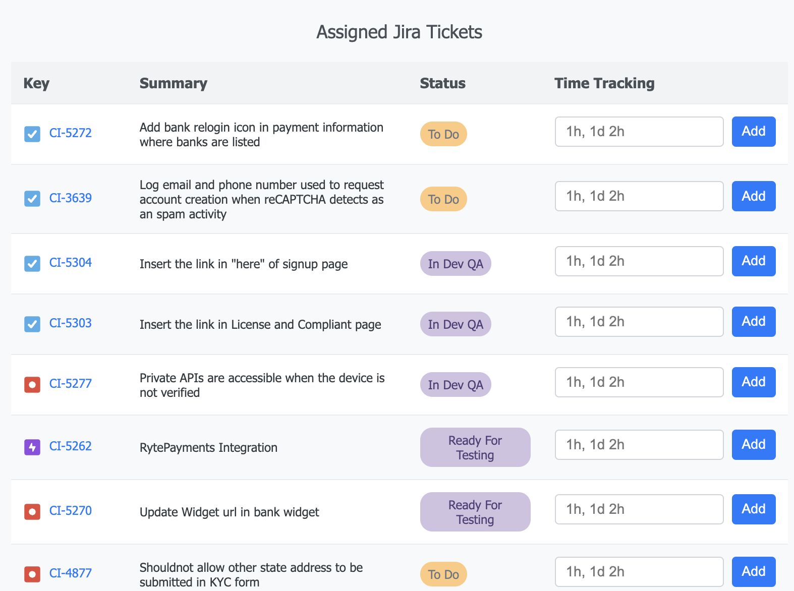

# Chrome Extension for Jira Ticket Management

A Chrome Extension that displays all unresolved Jira tickets assigned to the currently logged-in user. This extension provides an easy way to manage tickets, track progress, and log time spent directly within your browser.

## Features

- **Ticket Overview**: View a list of unresolved Jira tickets assigned to you, including details such as:
  - Ticket Key
  - Summary
  - Status
- **Time Tracking**: Log time spent on each ticket in formats like `1h`, `30m`, `1d 2h`, etc.
  - Dynamic UI to input time values
  - Real-time updates to Jira via API integration
  - Feedback on submission (success or error)
- **Quick Access**: Navigate to specific tickets or view all unresolved tickets with quick links.
- **Responsive Design**: A clean and intuitive user interface that adapts to your needs.

## Tools and Technologies

- **Frontend**: HTML, CSS, JavaScript
- **Browser Extension APIs**: Chrome Extension Messaging
- **Backend Integration**: Jira REST API

## Installation

1. Clone this repository:
   ```bash
   git clone https://github.com/your-repo-name/chrome-jira-extension.git
   ```
2. Load extension on Chrome (Locally)

- Open Chrome and go to chrome://extensions/.
- Enable Developer mode (toggle in the top-right corner).
- Click Load Unpacked and select your project folder.
- Your extension should now appear in Chrome

Author [Suranjan Rai](https://suray54.github.io/Rezume/)


